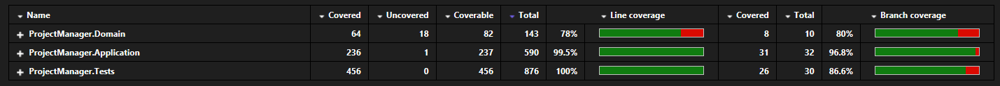

# ProjectManager

## Pré-requisitos
Verificar se o ficheiro entrypoint.sh dentro da pasta API está com o final de linha LR
Para isso abrir o ficheiro com o visual studio code e verificar no canto inferior direito se

Caso esteja assim pode  seguir para a execução


Caso esteja com CRLF

clicar em "CRLF", vai abrir uma janela, mude para LR e guarde o ficheiro pelo visual studio code

### Passos para excutar o projeto

1. Abra o terminal e navegue até a pasta raiz do projeto:

   ```bash
   cd pasta/raiz/do/projeto
   ```
2. Execute o comando para subir os containers
    ```bash
    docker-compose up --build
    ```
    Ou 
    ```bash
    podman-compose up --build
    ```
3. Para verificar se os containers estão rodando, execute
    ```bash
    docker ps
    ```
    Ou 
    ```bash
    podman ps
    ```

4. A api vai rodar na porta 8080, abra o navegador no link http://localhost:8080/swagger

## Coverage
Como tenho a versão community do Visual Studio não tenho essa funcionalidade, ela só existe na versão Enterprise, mas instalei a extenção [Fine Code Coverage](https://marketplace.visualstudio.com/items?itemName=FortuneNgwenya.FineCodeCoverage)



## Fase 2 - Refinamento
Faria várias perguntas para conseguir entender a ideia que o negócio quer implementar, tais como:

 - Um projeto pode ser compartilhado entre múltiplos usuários ou seria para ser privado (por usuário)?
 - Seria para adicionar subtarefas no futuro?
 - Será necessário algum tipo de ordenação ou categorização de projetos (ex: favoritos, arquivados)?
 - Haverá algum tipo de dependência entre tarefas (ex: tarefa B depende da A)?
 - Os comentários poderão ser editados/removidos no futuro?
 - O histórico precisa ser visível para os usuários? Ou é apenas para auditoria interna?
 - É necessário permitir menções (@user) ou ficheiro em anexo nos comentários?
 - Quais outros relatórios são previstos além da média de tarefas concluídas? E como seriam esses relatórios (pdf, excel, csv, word, algum dashboard em PowerBI)
 - Explica melhor quem define que usuário é gerente ou não, essa informação chegará até nós como? E, vai ter outro "papel" do usuário no sistema (gerente de projetos, apenas leitor)?
 - No futuro, o limite de 20 tarefas por projeto será configurável ou vai continuar a ser fixo? E quando o limite for atingido, será necessário o envio de algum tipo de notificação?
 - Sobre os usuarios, como vamos fazer o controle e permissões de usuário? Vem pelo header do endpoint (userid, jwt)?
 - Qual seria a estimativa de número de usuários que usariam o software? e quantos projetos em média um usuario iria criar?
 - Pretendem adicionar funcionalidades como tags/etiquetas?

Assim conseguiria entender o impacto do software e quais seriam os projetos passos do desenvolvimento de acordo com o que o/a PO pretende.

## Fase 3 - Final

Já desenvolvi o software seguindo os principios de DDD e Arquitetura Limpa (Clean Architecture), com a separação de camadas, implementação de repositories e interfaces e injeções de dependencia. E implementei o padrão CQRS para separar responsabilidades de leitura e escrita, caso o projeto cresça, implementar até dois bancos, um apenas de escrita (SQL) e um apenas de leitura (NoSQL) para tirar o máximo de proveito da CQRS e dos bancos, já que os bancos SQL são eficazes em escrita e os NoSQL são mais eficazes na leitura.

Separaria o container api do container do banco para não apagar os dados do banco sempre que precisasse subir alguma funcionalidade nova na api. Juntei as duas imagens apenas para facilitar a subida do ambiente para agilizar os testes, em ambiente de produção não é recomendado. Poderiamos até considerar guardar em volume os dados do banco mas mesmo assim os dois ficariam acopolados um ao outro e em ambiente de produção isso não seria recomendado.

Caso fosse para desenvolver mais funcionalidades nos comentários criaria um controller para ele e removeria ele do controller Tasks.

Implementaria alguma ferramenta de mensageria assincrona, como kafka, rabbitMQ, Azure Bus Service, SQS e SNS caso visse necessidade conforme as respostas do(a) PO.

Hospedaria o software na nuvem (Azure, AWS, GCP), utilizando serviços gerenciados adequados para APIs, como o Azure App Service, AWS Elastic Beanstalk ou serviços baseados em containers, como o Azure Container Apps, Azure Kubernetes Service (AKS), Amazon ECS ou Amazon EKS, para a hospedagem da aplicação. Para gerenciamento, segurança e exposição da API, utilizaria soluções específicas como o Azure API Management (APIM) ou o Amazon API Gateway

Implementaria algum pipeline de CI/CD para automatizar o deploy para o ambiente (Azure pipelines, github actions)

Implementaria também já um testcontainers com as novas ferramentas (kafka, rabbit) e o banco para ter testes de integração, testes estes que podem detetar erros de integração que os testes unitários não detetariam.

Implementaria também um framework de rastreabilidade, como o OpenTelemetry, para permitir o rastreamento distribuído e coleta de métricas, facilitando a integração com ferramentas de monitoramento e análise de logs, como DataDog, New Relic, dynatrace, grafana, kibana

## Considerações
Para mensagens de erro deixo mensagens padrão, sempre deixo por questões de segurança para passar o mínimo de informações para um possivel hacker.

No get das tarefas caso não exista o projeto (id) ou caso não existam tarefas relacionadas a ele eu mando a mesma mensagem de erro
404 - "nenhuma tarefa encontrada para o projeto"

Um outro exemplo é o endpoint de geração de reports, o usuario existindo e não tendo permissões de acesso ou o usuario nem sequer existir mando o erro
400 - "usuario sem permissões"